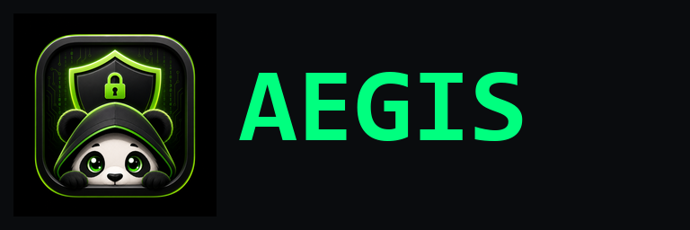

# Aegis

Kodi 21 (Omega) addon delivery for the Aegis build. Source lives in a
separate (private) repository; this repo carries only the signed release
payload that Kodi pulls.

## Install

**1. Add the source.**
Kodi → Settings → File Manager → Add Source
- Path: `https://badger-field.github.io/aegis/`
- Name: `aegis`

**2. Install the repository addon.**
Settings → Add-ons → Install from zip file → `aegis` → `zips/repository.aegis/` → newest `repository.aegis-*.zip`.

**3. Install Aegis Build.**
Settings → Add-ons → Install from repository → Aegis Repository → Video add-ons → **Aegis Build**.
This pulls in `netguard`, `vault`, `tvhub`, and `requests` automatically as dependencies.

**4. First launch.**
Open Aegis Build from the home screen. The first-run wizard handles consent, debrid
provider selection, and Real-Debrid OAuth — no further setup needed.

### Optional extras

Install these the same way (Install from repository → Aegis Repository → category):
- **Aegis Skin** (`skin.aegis`) — Look & feel. Activate via Settings → Interface → Skin.
- **Aegis First-Run Setup** (`service.aegis.firstrun`) — Re-runnable setup wizard service.
- **Aegis TVE** (`plugin.video.aegis.tve`) — TV-Everywhere providers.
- **Umbrella** (`plugin.video.umbrella`) — Real-Debrid scraper.

Dependencies resolve automatically — install Aegis Build first and everything
required to play falls in behind it.

Direct link to the current repository zip: <https://badger-field.github.io/aegis/zips/repository.aegis/repository.aegis-0.1.0.zip>

## What's in this repo

- `addons.xml` / `addons.xml.gz` — Kodi addon manifest with per-addon SHA256.
- `zips/<addon-id>/<addon-id>-<version>.zip` — built addon payloads.
- Last 3 versions per addon are retained for rollback.

All zips are produced by a deterministic build from pinned upstream commits.
